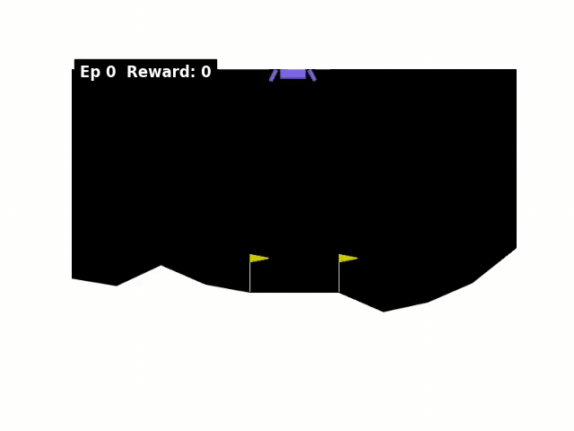
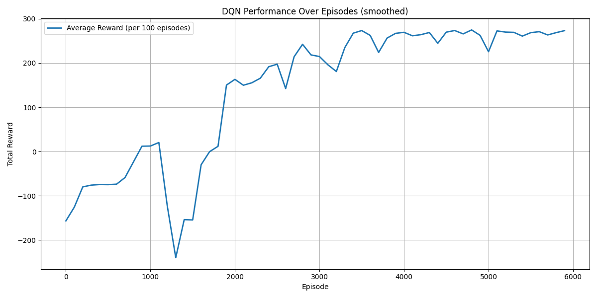

# Deep Q-Network (DQN) on LunarLander (Gymnasium)

This project implements a **Deep Q-Network (DQN)** to solve the [LunarLander-v3](https://gymnasium.farama.org/environments/box2d/lunar_lander/) task in Gymnasium.  
A neural network is trained with **experience replay** and a **target network** to approximate Q-values.

---

## Project Overview
- **Environment:** LunarLander-v3 (Gymnasium)
- **Algorithm:** Deep Q-Network (DQN) with epsilon-greedy exploration
- **State:** 8 continuous values (lander position, velocity, angle, etc.)
- **Actions:** 4 discrete actions (do nothing, fire left engine, fire main engine, fire right engine)
- **Reward:** 
  - Step-wise rewards:
    - Increased/decreased based on proximity to the landing pad
    - Increased/decreased based on lander velocity
    - Decreased the more the lander is tilted
    - +10 points for each leg in contact with the ground
    - -0.03 points per frame for firing a side engine
    - -0.3 points per frame for firing the main engine
  - Episode rewards:
    - +100 for landing safely  
    - -100 for crashing
  - An episode is considered solved if it scores at least **200 points**
- **Goal:** Land the lunar module safely on the landing pad

---

## Key Idea: Experience Replay with Target Network
- **Replay Buffer:** Stores past transitions for training with random mini-batches.  
- **Target Network:** Stabilizes training by periodically syncing weights from the main network.  
- **Epsilon Decay:** Gradually shifts from exploration to exploitation.  
- **Learning Rate Decay:** Reduced after 3000 episodes for stable convergence.  

---

## Trained Agent Visualization

  

> The GIF shows **8 separate episodes** of the trained agent safely landing the module.

**Note:** MP4 video export using `matplotlib.animation` requires **FFmpeg installed on the system**. Python packages alone (`matplotlib`, `gymnasium`, `torch`, `numpy`) are sufficient for training, plotting rewards, and in-memory animation, but saving MP4 files will fail if FFmpeg is missing.

---

## Training Performance

  

> The plot shows the **average total reward per 100 episodes**, smoothed to visualize learning progress.

---

## Requirements

- See `requirements.txt` for Python package dependencies.  
- Python 3.11.13 recommended.

---

## Files

- `dqn.py` → DQN model and agent implementation  
- `agent.py` → Training loop and execution script  
- `dqn_lunarlander.gif` → GIF showing 8 episodes of the trained agent  
- `training_rewards.png` → Plot of average reward progression over training  
- `dqn_model.pth` → Saved DQN model weights (pretrained, can be reused)  
- `requirements.txt` → Python dependencies  
